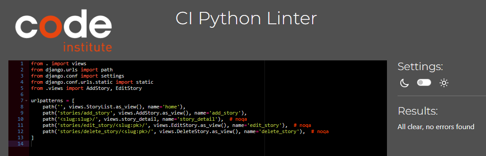

<h1 align="center">Shropcheer</h1>

Shropcheer is a positive news blog for local communities within Shropshire and has been created as a full-stack framework project, built using Django, Python, HTML and CSS. 

The live application can be viewed here : 

https://shropcheer-2a6907e40b3b.herokuapp.com/

# Purpose and Target Audience:
 **Problem Statement:** Within Shropshire, local newspapers are difficult to access. The largest local online news publication, The Shropshire Star website, is now hidden behind a paywall and the second largest publication, the Telford Journal, is now reducing its circulation. Another problem I have identified, is that  many online news outlets and social media algorithms have a tendency to push clickbait or negative news stories because research shows that angrier people are more likely to engage with posts and stay on the page for longer.

**Purpose:** Shropcheer will address both of these issues by hosting free to read, positive news stories about the local area. The aim is to highlight and celebrate the various communities within Shropshire in order to engender a positive feeling about local areas and enhance community spirit.

**Target Audience:** The target audience is mainly local residents of Shropshire, however this may also be a good resource for people looking at moving into the area.

# User Stories:

### Admin:

* As an admin I want to be able to be able to create, edit and delete stories so that I can maintain the website

### Site User (not logged in):

* As a site user I want to be able to browse through news stories so that I can enjoy reading content and find out if the site is for me.
* As a site user I want to know which area the article is focussed on so that I can tell if the article applies to my community. 
* As a non logged-in user I want to be able to create an account so that I can post my own content. 

### Site User (logged in):

* As a logged-in user I want to be able to post my own positive news stories so that I can share more positive stories with the local community. 
* As a logged-in user I want to be able to add images to my stories so they are more visually stimulating for the readers.
* As a logged-in user I want to be able to edit my stories so that I can provide updates or correct mistakes. 
* As a logged-in user I want to be able to delete my stories so that I can control the content that I am posting on the website.
* As a logged in user I want to be able to comment on a story so that I can interact with the author or other readers. 

## Wireframe & Initial Design:
### Home Page

### Home Page Logged in navbar change - User can now add a story and logout

### Story Detail Page

### Add a Story

## Agile:
This project was created using Agile principles via a projectboard on Github. The visual representation of tasks,
which were determined from the user stories, were a useful tool to map progress and understand which sections of 
the project needed to be worked on next. Defining acceptance criteria within each user story helped to make sure that 
all neccesary features and funtionality were implemeted. This method also helped to ensure that all features were crucial
to the core aims of the project, and time was not wasted on tasks that did not work towards these objectives. 

# Design Choices:

## Colour scheme:

Colour themes of blue and yellow were selected as these are the county colours that appear on the county flag of Shropshire. These colours will appear more as accents however, as there will be a minimalist design to not detract from the stories themselves. Main site background will be white to give some balance to the brightness of the blue and yellow. The yellow gives a positive, sunny and upbeat impression, matching the positive aims of the project. 

The colours are also reminiscent of the ‘BELIEVE’ sign in Ted Lasso, which is about a coach inspiring and bonding a team through a positive attitude. 

Header / Navbar - Yellow - #ffdc00

Shropcheer Brand - Blue - #3a0fe7

Buttons - Mostly Blue - #3a0fe7 - although next and previous page buttons are yellow to stand out from the blue footer

Footer - Blue - #3a0fe7

## Typography:
Londrina Solid has been used for the name / brand, and has been lightened in weight. This was to make it closer to the weight and font style of the Ted Lasso ‘BELIEVE’ sign which is referenced in the colour scheme section.

Didact Gothic was chosen as the main text font as it gives a simple and clean look which is very easily readable in large bodies of text, whilst 
still maintaining a modern and fun look. 

This font pairing was recommened on https://fontjoy.com/

## Priority Features:

### Home Page:

#### Navbar:

The navigation bar is clean and simple. When users are not logged in it shows 'home', 'register' or 'login'. This changes when the user creates an account and is logged in, to show 'home', 'logout', and 'add a story'. The way that the navbar changes means that the navbar is less cluttered and does not have to feature actions that a user is not yet authenticated for. This responsiveness also means that logged-in users do not have options in the navbar that do not apply to them, such as register or login. 

#### Intro:
The landing page provides a short introduction to the website, encouraging new users to sign up or login to be able to post their own stories
or comment. It also features the most recently uploaded stories so that users can quickly understand what the site is about without having to navigate too many pages.

#### Registration:

Registration allows users to comment on stories as well as add stories themselves. When users have submitted their own stories, they can also edit or delete these stories.

#### Sign In:

#### Stories:

Users are able to view numerous stories on each page and can quickly see who is the story author, what area of Shropshire the story is about, the news category of the story, and the date the story was posted. 

#### Story Details, Editing and Deleting stories:

When users click on a particular story they want to read it will load up the full article. If the story is one that the user
themselves have added, and they are signed into the corresponding account, they are also given the option to edit or delete their story. Summernote widget was added into the form so that html code is hidden and the story can be formatted correctly. 

#### Story Details, Comments:

Users who are not logged in can view comments at the bottom of the corresponding story. The ability to add a comment does not appear
and they are instructed to sign in to leave a comment. Users who are logged in can see a form to submit their own comment. 

#### Add a Story:

As mentioned in the navbar section, once the user is logged in an option appears to 'add a story'. The add story form allows users to enter  headline, body of text, upload an image, as well as select a location and news category. The location and category sections are drop down menu's, giving the user a list of available choices. The body section features a text editor loaded through the Summernote widget for customisation and formatting of text. 

#### Footer:

Links in the footer redirect to respective social media pages. 
It allows users to stay connected with Shropcheer on social media platforms, keeping them informed about any new stories.

# Future Features:

* Implement 'likes' on posts
* Allow users to sort or order posts by different options such as number of likes, or alphabitical location 

# Database Design:

Entity Relationship Diagrams (ERD) help the developer to make connections between databases and information. Creating an ERD helped me understand how the tables relate to one another. I used LucidChart to create the diagram and the arrow represent how the data fields relate to one another.

## Data Models:

| Story   |            |   |
|----------|:-------------:|------:|
| Headline |  CharField |  |
| Author |  ForiegnKey   |   FK |
| Slug | SlugField |     |
| Body |  TextField | |
| Image |  CloudinaryField   |   |
| Created_on | DateTimeField |     |
| Location |  CharField |  |
| Category |  CharField |  |

| Comments  |            |   |
|----------|:-------------:|------:|
| Story |  ForeignKey | FK |
| Name |  ForeignKey | FK |
| Created_on |  DateTimeField |  |
| Body |  TextField |  |

# Validation
## HTML

#### Home/Index page

Pass, no errors

#### Story details page

Pass, no errors. One warning for H1 tag in Nav, but needed this to override Bootstrap

#### Add story page

All errors showing are related to third party widget Summernote which was used in the body of the form.
Unable to adapt this code and advised by tutor support that this cannot be helped. 

#### Sign in page

Pass, no errors

#### Register page

Four errors, but all within all-auth code which I am unable to change

 ## CSS

 I have used the recommended [CSS Jigsaw Validator](https://jigsaw.w3.org/css-validator) to validate my CSS file.
 No errors found
 

## Python

I have used the recommended [PEP8 CI Python Linter](https://pep8ci.herokuapp.com) to validate all of my Python files and they all show no errors.

#### Shropcheer urls
No errors

#### Shropcheer settings
No errors

#### Stories urls
No errors

#### Stories views
No errors

#### Stories admin
No errors

#### Stories forms
No errors

### Stories models
No errors

# Responsiveness:
Development tools were used to test responsiveness on varying sized devices including laptop, mobile and tablet size.

Full testing was performed on the following devices:

Laptop:

* HP Pavilion 15.6""

Tablet:

* iPad Air

 Mobile:

* iPhone 12 Pro

The site is responsive and adapts well to the varying screen sizes (as evidenced below)

#### Mobile:

#### Tablet:

## Browser Compatibility:
 
 I have tested the site using the Google Chrome, Microsoft Edge and Mozilla Firefox. 
 The site works well on all three browsers

### Google Chrome

### Microsoft Edge

### Mozilla Firefox

# Testing:

## Lighthouse Audit:

I've tested my deployed project using the Lighthouse Audit tool to check for any major issues.

Home

Story details (logged in) 

Add a story 

## Manual Testing

### Non logged-in user

| Action | Expected Outcome | Grade |
| ------- | ---------------- | ----- |
| View Story Headlines | Homepage displays story headlines with author, posted date, location and category | Pass |
| Go to Next Page | Navigates to next page of stories when clicked | Pass |
| Got to Previous Page | Navigates to previous page of stories when clicked | Pass |
| View Story Details | Clicking headline navigates to the story details page | Pass |
| Edit / Delete Story | Cannot see any option to edit or delete story | Pass |
| Comments | Can view previous story comments / asked to start conversation if no comments | Pass |
| Comment | No comment form shown, asked to login to leave a comment | Pass |
| Add a Story | Cannot see navbar option to add a story | Pass |
| Register | Link on navbar works, loads registration page and allows user to sign up | Pass |
| Log in | Link on navbar works, loads login page and allows returning user to login | Pass |
| Return to home | Home link on navbar and Shropcheer logo both return user to homepage when clicked  | Pass |

### Logged-in user

| Action | Expected Outcome | Grade |
| ------- | ---------------- | ----- |
| Post Login Confirmation | Login success message appears once logged in | Pass |
| Delete Another Users Story | Cannot see option to edit or delete story if story was created by another user | Pass |
| Edit / Delete Own Story Button Load | Can see option to edit or delete story if story was created by that user | Pass |
| Load Edit Story | When edit button is clicked form loads with all story detail entered | Pass |
| Edit Story | When completed, confirmation message appears and story is successfully changed | Pass |
| Confirm Delete Request | When delete button is clicked a confirmation page loads to check if user wants to delete their story | Pass |
| Delete Story | When completed, confirmation message appears and story no longer appears | Pass |
| Comment | Comment form displays and posts comment when one is entered | Pass |
| Comment Confirmation | Confirmation message for comment posting successfully | Pass |
| Comment Count | Displayed comment number count increases by one when a comment is posted | Pass |
| Load Add Story | Navbar shows option to add story and add story form loads when clicked | Pass |
| Add Story | When form is completed new story is visible | Pass |
| Add Story Confirmation | When new story has been added a confirmation message appears | Pass |
| Logout | Link on navbar works, loads logout page and allows user to logout | Pass |
| Logout Confirmation | When user has logged out a confirmation message appears | Pass |

# Tools and Technologies Used:
The technologies implemented in this application included HTML5, CSS, Bootstrap, Python and Django.

* Python used as the back-end programming language.
* Git used for version control. (git add, git commit, git push)
* GitHub used for secure online code storage.
* GitHub Pages used for hosting the deployed front-end site.
* Gitpod used as a cloud-based IDE for development.
* Bootstrap used as the front-end CSS framework for modern responsiveness and pre-built components.
* PostgreSQL from Code Institute was used as the database.
* Heroku used for hosting the deployed back-end site.
* Cloudinary used for online static file storage.
* Lucidchart used for database design
* Balsamiq used for wireframes
* FontJoy was used for font pairing
* Djecrety was used to generate a secure django secret key
* Google, Stack Overflow, Phind Youtube and Slack was utilized for general research or solving a bug and information gathering.

# Languages Used:
* HTML5
* CSS
* Python

# Deployment :

I used the steps from deploying the django blog within the 'Developing with Django' section of the LMS to deploy this application. This was also cross referenced with the step in the 'Django Deployment Instructions 2024' pdf document which was supplied to us by our facilitator. 

# Bugs

All the bugs that occured during the creation of this application have been resolved.

# Credit: 

* Although I used the django blog resources provided on the LMS, I also received alot of additional clarification by following along with django projects on YouTube.

* Youtube vidoes I found especially helpful were:

 - https://www.youtube.com/watch?v=vXMTp_1_L7Y&t=280s
 - https://www.youtube.com/watch?v=nFa3lC105dM
 - https://www.youtube.com/watch?v=5JWElyGs8iA&t=463s

* Stack Overflow was used to solve any smaller bugs and further clarification on errors.

* Phind was used to help breakdown some key concepts and understand error messages. 

* Stories and photos were taken from the Shropshire Star website.

* Font Awesome was used for icons and the fonts used were derived from Google Fonts.

* Wireframes, were created using Balsamiq.

* ERD diagrams for database design were created with Lucidchart.

* The Book Booth by hiboibrahim was used as a framework for the readme.

* A special thanks to all the other indivudals in our WMCA cohort for their support throughout the course.

* Finally a big thank you to course facilitator Iris for her excellent support and guidance.
